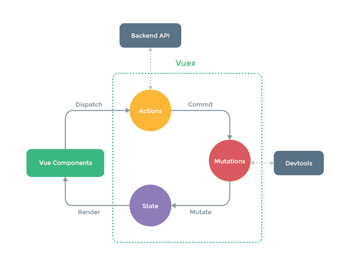

# vuex evil singleton	

* web ([link](https://github.com/jwausle/vuex-evil-singleton)) 
* clone ([https://github.com/jwausle/vuex-evil-singleton.git](https://github.com/jwausle/vuex-evil-singleton.git))

Vuex sample to show the risk of the evil singleton state handling.

## Project setup

```
# Checkout and setup
git clone https://github.com/jwausle/vuex-evil-singleton.git
yarn install
```

```
#  Compiles and hot-reloads for development
yarn run serve
```

## Blog

State is evil and singletons too. Vuex is both but nobody talk about. Dont get me wrong: "I love vuex - but from developer point of view there are some pitfalls they require strong discipline."

> Thats the magic marketing picture. 



It's show exactly one state mutation lifecycle 
> [State -> render -> Component -> dispatch -> Actions -> commit -> Mutations -> mutate -> State]. 

Nice :) clean and simple. The truth is that there is also a relation betwenn 
> [Component -> mutate -> State] directly. 

And nobody take care of despite the developer:

- no language feature
- no compile feature
- no lint feature

Only the discipline during development. Every component has access to `$store.state.*` references. And this references are the pitfalls. If I change a value there than this changes are present for everybody without Actions or Mutations.

That's ugly :# ... What can I do? I guess the best guess is: 

> The store should _only_ return copies of state objects.

